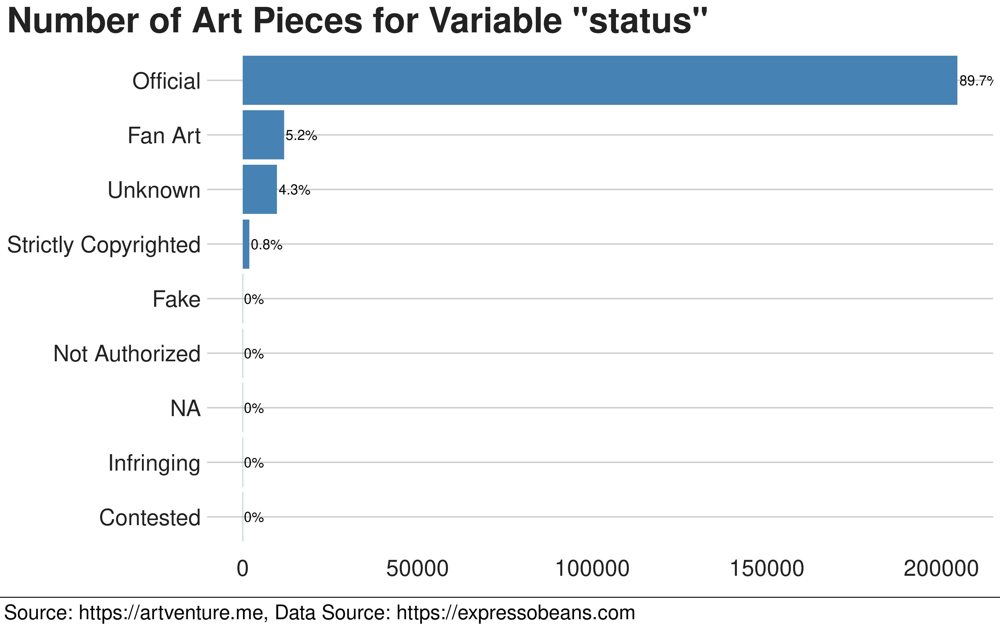
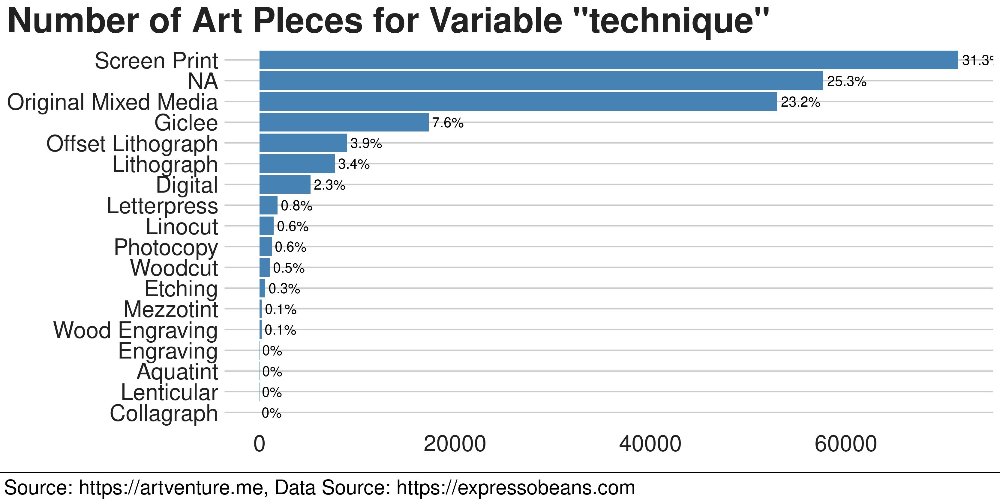
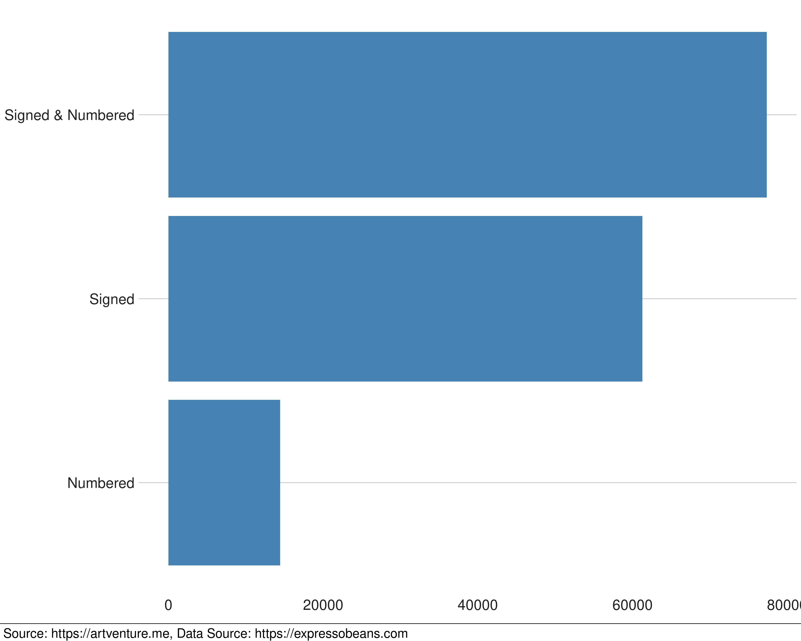

```{r setup, include=FALSE}
knitr::opts_chunk$set(echo = F, message = F, warning = F)
```

```{r}
library(tidyverse)
library(glue)
library(bbplot)
library(ggthemes)
library(aws.s3)
library(knitr)
library(scales)
```

```{r}
ART_DATA_URI <- "s3://artventure-8cgc8pg/art_pieces.csv"
Sys.setenv("AWS_DEFAULT_REGION" = "us-east-1")
```


```{r}
data <- s3read_using(read_csv, object = ART_DATA_URI) 
```


```{r include=F}
plotQual <- function(data, var) {
  varData <- data %>%
    mutate(total = n()) %>%
    group_by(!!sym(var), total) %>%
    summarise(n = n()) %>%
    mutate(pct = n / total) %>%
    arrange(n) %>%
    #drop_na() %>%
    ungroup()
  
  plot1 <- varData %>%
    mutate(pct = round(pct * 100, 1)) %>%
    ggplot(aes(!!sym(var), n)) +
    geom_bar(stat = "identity", fill = "steelblue") +
    coord_flip() +
    geom_text(aes(label = "{pct}%" %>% glue()),
              hjust = -.05) +
    scale_x_discrete(limit = varData %>% pull(!!sym(var))) +
    labs(title = 'Number of Art Pieces for Variable "{var}"' %>% glue()) +
    bbc_style()
  
  plot1 %>%
    finalise_plot(
      source = "Source: https://artventure.me, Data Source: https://expressobeans.com",
      width_pixels = 800,
      height_pixels = 500,
      save_filepath = "{var}.jpg" %>% glue()
    )
}


c("class", "status", "technique", "markings") %>%
  map( ~ plotQual(data, ..1))

numArtpieces <- data %>% 
  distinct(class) %>% 
  pull(class) %>% 
  length()

```


On my data-driven "Artventure" of investing in art I started analysing data to gain insights about the art ecosystem. Therefore, I have been scraping data from a website called [ExpressoBeans](https://expressobeans.com), which is an art collector's community maintained by volunteers. It is an excellent start for public available data about art pieces.

From the website I could get gather data from over 220,000 art pieces. The data set contains different features of interest:

### Class

The class feature describes what kind of art the artwork is. There are `r numArtpieces` classes available, however about 90% are Posters, Art Prints or Original Art.


```{r wi, fig.height=3, fig.width=6}
include_graphics("class.jpg")
```
 
Around 88% of all art pieces are Posters, Print Art and Original Art. I wrote in my article [A Cost Effecti]()

  
### Release Date

I visualized the number of art pieces for different release year buckets. Almost 80% of all the art pieces were released between 1992 and 2021. Although the oldest art piece was from 1662, you can say the expressobeans data set is modern art data set.

```{r fig.height=10, fig.width=20}
data %>%
  mutate(total = n(),
         year_bucket = cut(year, 25, dig.lab = 4)) %>%
  group_by(year_bucket, total) %>%
  summarise(num = n()) %>%
  mutate(pct = round(num / total * 100, 1)) %>%
  ggplot(aes(x = reorder(year_bucket, num), y = num)) +
  geom_bar(stat = "identity", fill = "steelblue") +
  
  geom_text(aes(label = "{pct}%" %>% glue()),
            vjust = -.1, size=8) +
  scale_x_discrete(guide = guide_axis(angle = 45)) +
  #coord_flip()
  labs(title = "Art pieces Release Date") +
  bbc_style()
```


### Status

Almost 90% of the art in the data set is official, 5% is fan art created by fans of artists, musicians,
an author or somthing similar.

```{r}
fanArt <- data %>% filter(status=="Fan Art") %>% 
  mutate(image="https://expressobeans.com/visual/IS.php?id={id}&t=md" %>% glue()) %>% 
  arrange(-average_price) %>% 
  head(1)
mostValuedFanArt <- fanArt$artwork[1]
mostValuedFanArtPrice <- fanArt$average_price[1]
mostValuedFanArtArtist <- fanArt$artist[1]
mostValuedFanArtClass <- fanArt$class[1]
mostValuedFanArtImage <- fanArt$image[1]
```
To get an idea what Fan Art is the piece "`r mostValuedFanArt`" from `r mostValuedFanArtArtist` which average selling price was $`r mostValuedFanArtPrice`.

```{r}
include_graphics(mostValuedFanArtImage)
```


```{r}

```

### Run
### Technique

The technique is the way the art piece is created. The most common techniques are Screen Printing and Original Mixed media which are print art techniques.

```{r}

```

### Size


### Markings


```{r}

```
```{r}

```


### Artwork's name
### Artist's name
### Artist's pseudonym
### Original Price
### Collections
### Sold
### Six Month Average Price
### Average Price
### Lowest Price
### Highest Price

