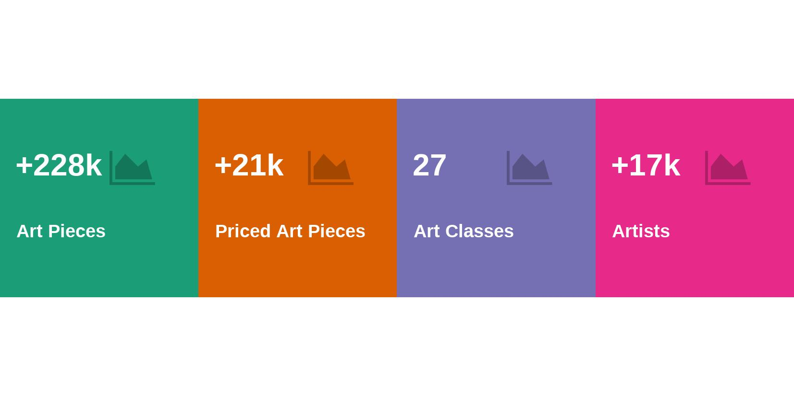

```{r setup, include=FALSE}
knitr::opts_chunk$set(echo = F, message = F, warning = F)
```

```{r}
source("R/data.R")
```


```{r}
totalArtPieces <- data %>% nrow()
numArtClasses <- data %>% distinct(class) %>% nrow()
numArtists <- data %>% distinct(artist_id) %>% nrow()
totalArtPiecesWithPricing <- data %>% 
  drop_na(original_price, average_price, lowest_price, highest_price) %>% 
  nrow() 

totalNumPrintArts <- data %>% filter(class == "Art Print") %>% nrow() 
totalNumPrintArtsWithPricing <- data %>% filter(class == "Art Print") %>% drop_na(original_price, average_price, lowest_price, highest_price) %>% nrow() 
```


```{r}
source("R/vis.R")
width <- 6
values <- c(
  paste0("+", round(totalArtPieces / 1000, 0), "k"),
  paste0("+", round(totalArtPiecesWithPricing / 1000, 0), "k"),
  numArtClasses,
  paste0("+", round(numArtists / 1000, 0), "k")
)
labels <- c("Art Pieces",
            "Priced Art Pieces",
            "Art Classes",
            "Artists")
num <- values %>% length()

facts <- data.frame(
  x = rep(seq(2, num * width, width)),
  y = rep(width, num),
  h = rep(6, num),
  w = rep(width, num),
  value = values,
  info = labels,
  shape = rep(fontawesome(search_fontawesome("chart")[1]), num),
  font_family = rep("fontawesome-webfont", num),
  color = seq(1, num, 1) %>% as.factor()
)

valueBox <-facts %>% 
  valueBoxes() +
  labs(title = "An Artwork Investor's Data Set", subtitle = "Overview") +
  theme(
      axis.title = element_blank(),
      plot.margin = margin(-0, -.7, 0, -.7, "cm")
    ) +

ggsave("overall_overview.jpeg", width = 14, height = 7, units="cm")
#valueBox
```


```{r}
library(gridExtra)
library(grid)
library(ggtext)
library(RCurl)
library(png)
library(jpeg)


logo <- "https://res.cloudinary.com/jenslaufer/image/upload/c_scale,w_30/v1615555957/Artventure_Logo2.png" %>% 
  getURLContent() %>% 
  readPNG(native = T)

art_classes <- data %>%
  group_by(class) %>%
  summarise(num = n()) %>%
  drop_na(class) %>%
  mutate(total = sum(num), ratio = num / total) %>%
  arrange(-ratio) %>%
  mutate(
    group = if_else(
      class == "Poster" |
        class == "Original Art" |
        class == "Art Print",
      "Common",
      "Other"
    )
  ) %>%
  group_by(group) %>%
  mutate(ratio2 = sum(ratio), num2 = sum(num)) %>%
  mutate(
    ratio2 = if_else(group == "Common", ratio, ratio2),
    class2 = if_else(group == "Common", class, group),
    num2 = if_else(group == "Common", num, num2)
  )  %>%
  ungroup()

art_class_plot <- art_classes %>%
  distinct(class2, ratio2, num2) %>%
  mutate(ratio2 = ratio2 * 100) %>%
  rename(class = class2, ratio = ratio2, num = num2) %>%
  mutate(label = if_else(ratio > 20, paste0(round(ratio, 1), "% (", num, ")"), paste0(round(ratio, 1), "%"))) %>%
  ggplot(aes(
    x = '',
    y = ratio,
    fill = factor(
      class,
      levels = art_classes %>% distinct(class2, ratio2) %>% arrange(-ratio2) %>% pull(class2)
    )
  )) +
  coord_flip() +
  geom_bar(stat = 'identity') +
  geom_text(
    aes(label = label),
    position = position_stack(vjust = 0.5),
    colour = "white",
    size = 9,
    fontface = "bold"
  ) +
  scale_fill_tableau(limits = art_classes %>% distinct(class2, ratio2) %>% arrange(ratio2) %>% pull(class2)) +
  annotation_custom(roundrectGrob(), xmin = 6.5, xmax = 8.5, ymin = -5, ymax = -8.5) +
  bbc_style() +
  labs(title = "An Art Investor's Data Set", subtitle = "Most Common Art Classes", caption = "Source: https://artventure.me Data Source: https://expressobeans.com") +
    theme(axis.text.x = element_blank(), 
          plot.caption = element_text(hjust = 0, size=15, face = "bold"), plot.subtitle = element_text(size = 20))

ggsave("art_classes.jpeg", width = 14, height = 7, units="cm")

```


A few weeks ago I started my ["Artventure"]() of investing in physical art pieces. As a software-/machinelearning engineer and data analyst I want to follow a data driven approach, although I am sure that my journey won't be just dead-dry analysis as art is pure emotion. To get the answers for my [questions]() I needed data, which I found on the website [Expresso Beans](https://expressobeans.com). The website is an art collector's community resource built and maintained by a volunteer staff. Although the design of the website is old-fashioned, it's a gold mine for art pieces. Thanks to the community for this excellent website.

To gain insights from the data with a analyst's toolset I developed a web scraper in Python which pumped the data into a MongoDB database. From the database I was able to a first exploratory data analysis (EDA) with the help of R, which I like more for data analysis than Python.

In these article I want to share my results of the first analysis. In case you are interested in the data set you can send me [message](mailto:jens@artventure.com).

### What is the data set about?


#### Overview 

```{r}

```

The data set holds information about over 228,000 art pieces in 27 art classes from more than 17,000 artists. For about % (~21,000) of the the artwork basic pricing data is available like original, average, lowest and highest price.


#### What are the most common art classes are in the data set?

The art classes are uneven distributed, as there are very exotic art classes, like magnets, button or backstage passes. The most cowmmon art classes are Posters, Original Art and Posters. They make almost 90% of all art classes in the data set.


```{r}
include_graphics("art_classes.jpeg")
```


```{r}
data %>% 
  filter(average_price!=999999.99) %>% 
  arrange(-average_price) %>% 
  mutate(label='{artist}: "{artwork}", {year}' %>% glue(),
         image='https://expressobeans.com/visual/IS.php?id={id}' %>% glue()) %>% 
  select(label, image, average_price, class)
```


### Which variable describe the art pieces?